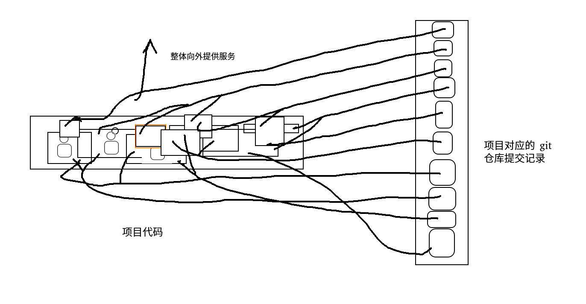
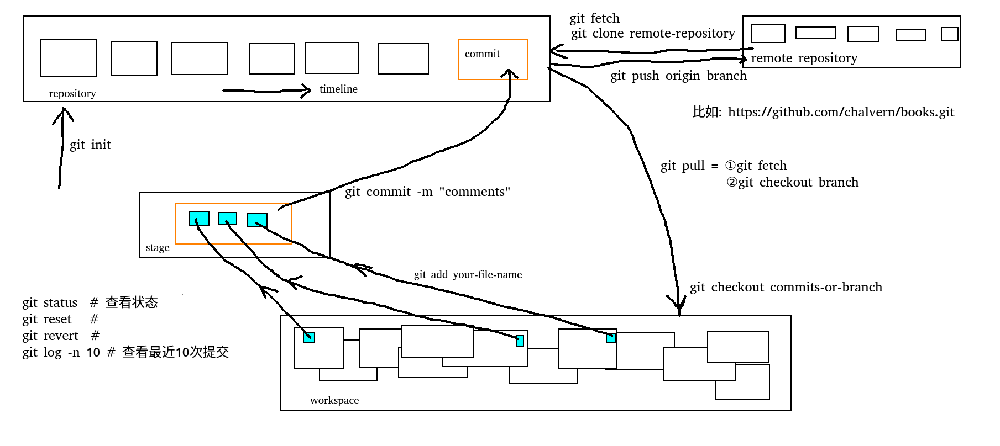

# 安装 git 并简单使用。

## 下载并安装 git

在 ubuntu 中下载安装 git 还是比较简单的，

我们可以打开 terminal 终端，首先敲击 `git` 命令，如果我们系统还没有安装 git， console 会提示我们“尚未安装 git”，并且给出 `sudo apt install git` 的命令，这个时候我们只需要复制这条命令，然后粘贴到命令行执行就可以了。

```bash
sudo apt install git 

# 下面就是长篇的安装输出提示，可能会要求我们输入 Y，输入即可
# ....
```

安装完成之后， git 就可以作为我们的一个工具来使用了。

## Git 概论

对于一个完整的项目来说，可能包含了很多的模块，整体向外提供一套完整的服务。我们在项目的开发的过程中，可能会首先编写一个模块的代码，然后再开发另一个模块的代码。对于一个中大型的项目，甚至会不同的人负责不同的模块进行开发。

在项目创建初期，各个模块之间的关联关系比较清晰，每个开发者的职责划分也比较清晰。不过为了更好地审视整个系统的功能，依然需要一个明确的方式来 review（审核） 代码。比如 模块（或类）A 的同事依赖调用 模块（或类）B 的接口，那么架构层面的负责人可能会同时查看两个模块的代码，从而保证各自的逻辑是恰当的。同时也要能够跟踪每条语句的作者，一方面可以记录贡献，另一方面在出现疑问或问题的时候也可以第一时间找到编码者进行答疑或修正。

到功能迭代阶段，除去新的模块或类，一般还会修改已有的模块或类，这个时候就特别需要收集“老代码”的各种信息，比如作者、修改记录、注释、文档等；同时为了以后方便进一步迭代，需要留下当前的记录、注释、文档等。按照时间线把一次次变更详情记录下来，这就是 git 工具的核心功能。



上图中，左边表示我们项目视角的结构图，每个方框表示一个模块，各个模块相互联系耦合到一起共同形成一个系统，整体向外提供服务；右边表示 git 的提交（commit）视图，一次次的提交形成一个可追溯、“有序”（当引入分支以后局部次序也会显得比较乱）的链条。


## git中的概念

为了实现可追溯的链条



### 在 vscode 中使用 git