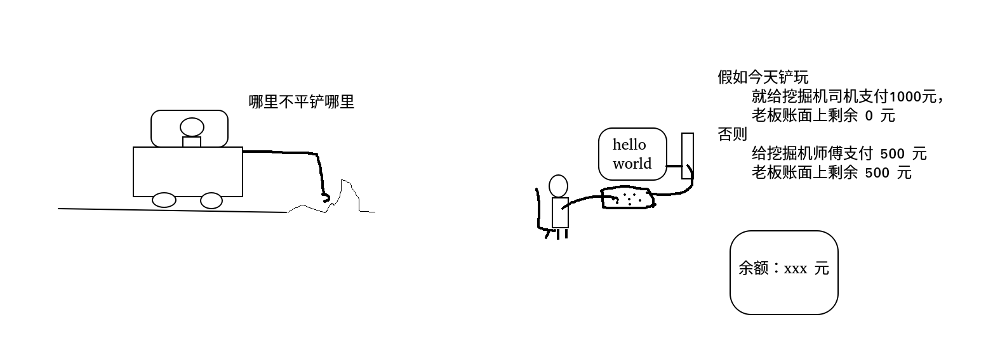

# 挖掘机司机和程序员有什么区别？

## 概述

区别
1. **工作内容不同**：前者开挖掘机，后者写代码。
1. **控制对象不同**：前者控制的是挖掘机，后者控制的是计算机。挖掘机司机操纵机械臂，把东西搬来搬去放到恰当的位置；程序员操纵的是逻辑单元，把逻辑问题拆解然后通过逻辑单元的组合来表示这种逻辑。
1. **精度要求不同**：前者涉及的是实物形态的具体改变，精度要求没那么高；后者涉及的是逻辑问题，在一个系统里面一处逻辑出错可能导致整个系统出问题，因此精度要求很高。
1. **工作时间不同**: 前者一般白天作业，后者一般白天和晚上都要作业。

联系
1. **都是劳动者**；
1. **都存在领域知识**：挖掘机司机分初、中、高级别，程序员也分初、中、高级别。
1. **工种的没落**：一旦程序员有能力把开挖掘机抽象成为逻辑问题，挖掘机司机会越来越少直至少的可怜。

## 几个具体的问题

### 1. 程序员可以开挖掘机吗？

相对于编写代码，开挖掘机是一件精度要求低的工种，理论上从高精度到低精度迁移是比较容易的。因此是可以去尝试的。

### 2. 挖掘机司机可以写代码吗？

需要更多的学习。相对于开挖掘机，编写代码是一件精度要求更高的工种，从低精度到高精度迁移比较难，需要付出更多来精进自己。（可能开挖掘机的老师心里想：老子TMD才不稀罕写代码做加班狗=。=）

> 高精度的工作往往意味着工作者**掌控**更多的细节。换个说法就是，一个工种要求掌控的细节越多，其精度要求一般就越高。
>
>99.99% 的纯度和 99.9999% 的纯度，数值上差不到 0.01%，但是只有后者纯度的硅单晶才可以做成芯片，即这 0.01% 决定了 **能**还是**不能**。

### 3. 假如开挖掘机的想转行写代码，学习路线图是什么？

首先大家要明确，开挖掘机和写代码解决的问题属于两个完全不同的范畴，这种跨界需要付出很多的艰辛。另外大家要意识到：

1. 需要自己有比较好的逻辑思维能力，比如能够理清自己每个月的收入与支出，在个人支出上有自己的决策；在这里会包含下面的逻辑：①假如这个月买新手机，那么自己剩余多少钱，否则，自己可以节省多少钱；②当自己每个月的钱剩余多于 n 元时，可以买本书看；当买的书读完以后发现结余依然多于 n 元，可以再买本书继续看，依次直到 n 元。
2.  开挖掘机操作的是机械臂，写代码操作的是CPU、内存以及输入设备、输出设备；本质上都是让机器替代我们完成一些事情。意味着如果自信有能力开好挖掘机，那么也有能力写好代码。
3.  大家可以先看看自己是否能够听明白下面的内容：

    3.1 单输入单输出。比如灯泡，只有开关两个逻辑。

    3.2 多输入单输出。比如一种特殊的电路板灯泡矩阵，组合开关决定哪个灯泡亮。

    3.3 多输入多输出。比如另一种特殊的电路板灯泡矩阵，两次组合开关决定哪些灯泡亮。

    3.4 （现在不懂也没关系）所有的代码都是在一种成为 CPU 的芯片上面执行的，CPU 是一个多输入多输出的设备（输入的脚特别多，输出的脚也特别多）。对于类似 `print(1 + 1)` 这样的 python 代码，`1 + 1`的计算最终会变成 CPU 内部子电路某些输入的电信号的组合，最终输出一个结果 `2` 。

假如大家可以看的懂上面的内容，且感觉自己有兴趣继续学习下去，那么可以继续跟着本系列视频进行学习（当然也可以找其他的视频进行学习=。=）。

### 4. 假如程序员想去开挖掘机，学习路线图是什么？

先把老板的需求做完。

## 小结

每一个工种都需要我们付出足够的时间和精力掌握它的领域知识，都需要我们怀着敬业之心认真对待。

从初级到高级，让我们一起前进吧！

